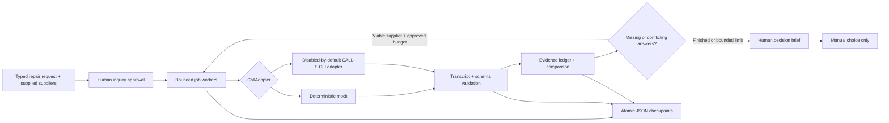

# Architecture and invariants



## Domain

`Job` carries the exact request, manufacturer/model, requested quantity, currency, absolute deadline, fulfillment, timezone, named targets and inquiry policy. No phone numbers, language, currency or location are inferred. `Question` is a typed field and a bounded prompt. All eight core fields must exist and be required.

`Call` identifies one target and one round. `runId` preserves the opaque provider ID; all accepted claims link to the local call which holds that ID. Each `Evidence` entry has its field, typed value, exact quote, character span, observation timestamp, source type, and explicit supersession links. The result schema is application-owned; it is not falsely advertised as an MCP parameter.

`Artifact` version 1 contains job, mode, evaluation time, calls, evidence, comparison, ordered events, review audit and human choice. Export its JSON Schema with `npm start -- schema`. A future dashboard can render supplier tracks and answer cells from this record without changing the orchestration engine. The Markdown brief is a projection, not a separate source of truth.

## Adapter boundary

`start(CallRequest)` returns a stable run identity. `poll(runId)` returns active or a validated terminal result. The mock implements the same boundary. Tests use a fake CLI runner beneath the real adapter, so argument/envelope behavior is exercised without phone access.

CALL-E's CLI executes plan_call then run_call with its exact private confirmation values. PARTLINE never passes confirmation values in process arguments or logs. The CLI owns the OAuth cache and any private call-recovery records outside the workspace. No vendor tool or returned command is directly invoked from data.

The live runner invokes Node with an absolute `calle.js` path using argument arrays and `shell:false`. It only permits status/start calls after explicit enablement; Mission 001's CLI never enables them. It filters inherited environment variables so endpoint/token overrides and Node injection do not pass through. Its stderr and native exception details are suppressed.

## Reliability

State transitions:

```text
queued → dispatching [checkpoint before start]
       → active [checkpoint stable run ID] → completed / failed
                                         → monitoring_paused → active on resume
dispatching after crash → uncertain → operator review
budget/deadline denial → blocked
```

Only confirmed pre-execution failures retry a start, with bounded exponential backoff. A missing acknowledgment, malformed response or native start exception is uncertain. An unknown vendor status remains active. All documented terminal states stop polling, including NO ANSWER normalization. A completed conversation does not prove that inventory meets requirements.

The application waits 60 seconds before its first subsequent live poll, then at least ten seconds between reads. The installed CLI itself performs a best-effort initial status read during start. Local poll exhaustion preserves the run ID and pauses monitoring; it cannot cancel the external call. Restarts poll saved IDs instead of starting new calls.

The max-call budget conservatively reserves an attempt slot for each logical contact, including uncertain starts. Confirmed failed planning retries reuse that slot because no phone call started. Follow-ups consume new slots. The budget limits PARTLINE submissions; whether the upstream service can autonomously redial internally must be verified in the consented experiment. The goal explicitly requests one attempt and no scheduling.

Concurrency is per job. A file lock prevents two processes from operating one job. It is not a cross-job/provider-wide rate limiter. Parallel worker snapshots are serialized before atomic rename. A dispatch intent surviving a crash is treated as uncertain; this intentionally chooses manual recovery over the possibility of duplicate calls. A crash may leave a lock or temporary file. Inspect the process/provider status before manual cleanup; the application does not auto-steal locks.

## Evidence and comparison

The transcript is treated as untrusted text. Invalid spans, mismatched quotes, unsupported value types and secret-bearing content are rejected. Text is sanitized before output; a redacted transcript from a raw result invalidates its old claim offsets. The live parser operates on sanitized text and accepts only explicit supplier-labeled values. No general LLM extractor or speaker diarization is claimed.

Fresh, explicit, nonconflicting values become supported cells. Tentative, absent, stale and conflicting facts remain unresolved. Repeated identical claims do not inflate coverage. A correction must identify prior evidence of the same field and target and contain explicit correction wording. Old evidence stays in the ledger. Human review can annotate unsupported speech, with reviewer audit; it does not change observation freshness.

Hard constraints check availability, exact model, quantity, absolute deadline and fulfillment. Only matching-currency, tax-inclusive total prices rank together; there is no implicit exchange-rate conversion. Nonempty supplier constraints require human review. Supported options rank first, followed by incomplete and disqualified ones; price orders within a class. The report calls coverage a completeness fraction and reports categorical uncertainty, not a calibrated probability.

## Human boundaries

Inquiry approval and purchasing choice are separate. The call grant binds an immutable job fingerprint, mode, expiry and budget. Before dialing in a later mission, a trusted UI must issue it only after the actual user approves those destinations and questions. A JSON flag from an untrusted client must never serve as authority. The current local API assumes a trusted process and operator; multi-user authentication/authorization is not implemented.

Human choice is revalidated against current evidence and deadline and sets `executable:false`. There is no purchase/commit executor, payment integration or implicit booking path. Supplier statements and result hints cannot create approval. Any imported evidence clears the prior choice.

## Boundaries for the next build

- Persist source observation time from actual provider call timestamps once live format is verified; current evidence uses the persisted call start time conservatively, so delayed retrieval cannot refresh old stock claims.
- Replace the narrow transcript parser with an evaluated extractor and speaker-aware evidence validation after collecting consented samples. Require correction provenance and protect against agent utterances being mistaken for supplier evidence.
- Add cancellation/control UI and a global contact/concurrency budget before multiple simultaneous live jobs.
- Add an authenticated dashboard, private transcript storage with retention/deletion controls and encrypted storage where required. Current local JSON is not encrypted.
- Add business-hours checks and explicit per-supplier willingness/opt-out records before any broader pilot.
- Validate every call instruction and disclosure in practice. Prompt-based restrictions reduce risk but do not mathematically guarantee a third-party voice model's behavior.
