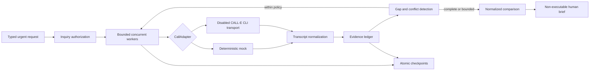

# PARTLINE architecture and safety invariants

PARTLINE turns time-sensitive supplier conversations into a conservative, inspectable decision brief. It has two deliberately separate data paths: a deterministic simulation for broad behavior and one sanitized, versioned proof bundle from a consenting CALL-E role-play. Neither dashboard path can initiate a call or transaction.



## Domain model

`Job` fixes the exact manufacturer/model, requested quantity, currency, absolute deadline, IANA timezone, fulfillment method, targets, required questions, and call limits. Phone destinations never enter this model: targets contain opaque contact references, while a live adapter resolves an authorized destination only in process memory.

Each `Call` belongs to one target and one round. Each `Evidence` item retains a typed value, the exact supporting quote, source span, observation time, source class, and supersession links. `Artifact` stores the job, mode, calls, evidence, comparison, ordered events, review audit, and optional human choice. The Markdown brief and dashboard are projections of that record rather than independent conclusions.

The comparison engine treats absence as unknown, never as zero or false. Exact model, quantity, availability, ready time, and fulfillment are hard qualification constraints. Only tax-inclusive totals in the requested currency are ranked. A cheaper wrong model cannot outrank a qualifying offer.

## Adapter and CALL-E boundary

`CallAdapter.start(request)` returns an opaque stable run identity; `poll(runId)` returns a validated active or terminal result. The deterministic adapter implements the same interface. Adapter tests place a fake runner below the CALL-E adapter, exercising argument and response handling without reaching a phone service.

The real transport is disabled by default. When separately and explicitly enabled, the installed CALL-E CLI performs the vendor `plan_call` then `run_call` sequence for one authorized start; status monitoring maps to `get_call_run`. Private confirmation material remains inside the CLI and is never placed in command arguments, logs, project artifacts, or frontend data. The runner uses an absolute executable path, argument arrays, `shell:false`, a filtered environment, and redacted errors.

Mission 004 does not import, initialize, or invoke this adapter. Both dashboard servers are GET-only. The portable package contains JavaScript data, not an execution endpoint.

## Orchestration, retries, and crash recovery

```text
queued → dispatching [intent checkpoint]
       → active [stable run ID checkpoint] → completed / failed
                                        ↘ monitoring_paused → poll saved ID
dispatching without acknowledgement after crash → uncertain → operator review
policy or deadline denial → blocked
```

- A concurrency semaphore limits active logical supplier work.
- A max-call budget counts initial contacts and follow-up rounds.
- Only a confirmed pre-start failure can retry, with bounded exponential backoff.
- Missing acknowledgement, malformed start output, or an ambiguous native exception becomes `uncertain`; PARTLINE will not redial it.
- Poll exhaustion preserves the run identity and pauses monitoring. Resume polls that identity instead of starting again.
- Declined, no-answer, busy, voicemail, and terminal failures do not cause automatic redials.
- Follow-up questions are allowed only for viable suppliers, unresolved required fields, and remaining policy budget.
- A process lock prevents two local workers from operating the same job. Checkpoints are written through temporary files and atomic rename.

The deterministic judge scenario runs two workers with a six-call logical budget and at most one follow-up per supplier. Its timeline uses recorded event sequence numbers, not fabricated wall-clock call duration.

## Transcript ingestion and provenance

Transcript text is untrusted input. The real-format parser recognizes timestamped `BOT`/`USER` lines, joins consecutive BOT lines into a single question, and permits only recipient `USER` speech to support supplier claims. Invalid spans, quote mismatches, secret-bearing content, unsupported types, and ungrounded fields are rejected.

Fresh, explicit, non-conflicting claims produce supported cells. Tentative, absent, stale, or conflicting claims remain unresolved. A correction retains the earlier evidence and must explicitly supersede it. Relative readiness stays an instant bound; it is not converted into an invented exact time. Coverage is completeness across eight required fields, not probability, truth, or inventory certification.

## Reproducible judge data paths

```text
tracked proof/mission-002 + deterministic MockAdapter
                    │
            schema + hash + provenance validation
                    │
          ┌─────────┴─────────┐
          │                   │
  source dashboard       judge:build
  in-memory model         embedded data.js
  GET-only loopback       static GET-only package
```

The source dashboard does not read `.runs`, provider caches, OAuth state, environment credentials, or phone data. It regenerates the deterministic scenario in memory and loads only the tracked proof bundle. `judge:build` first performs the same strict load, then emits relative frontend assets, an embedded sanitized view model, deterministic build metadata, and a verified copy of the proof bundle under `dist/judge/`.

The static package can be opened directly or served locally. It has no network dependency, backend mutation route, live adapter, or authentication requirement.

## Sanitized proof and integrity

`proof/mission-002/validation.json` is an allowlisted projection of the one completed consenting role-play: one start attempt, zero redials, seven recipient-supported fields, one same-call warranty clarification, and no purchase or reservation. `constraints` remains unknown. The transcript contains only dialogue needed to inspect those claims; direct contact and provider-private identifiers are omitted.

`integrity.json` hashes the three tracked proof files with SHA-256 after documented CRLF-to-LF normalization, then hashes the ordered filename/digest list. Loading checks the exact manifest file set, each digest, the bundle digest, strict schemas, phone/secret rejection, and exact quote-to-line provenance.

This is artifact-integrity evidence only: it detects changes to the sanitized bundle. It is not a digital signature, provider attestation, proof of consent, proof of speaker identity, or independent verification that a supplier claim was true.

## Human decision boundary

Inquiry authorization and purchase authority are different capabilities. The live grant, when used outside this mission, binds an immutable job fingerprint, destination fingerprints, mode, expiry, purpose, and budget. It cannot confer transaction authority.

The output recommendation is always `executable:false`. There is no transaction adapter, order API, reservation API, payment path, appointment path, or mutation endpoint. A human choice is revalidated against current model, quantity, readiness, fulfillment, currency, and evidence freshness. Imported evidence clears any previous selection.

## Trust boundaries and residual limits

- Supplier speech is evidence of what was said, not independent stock certification.
- The real sample is one consenting role-play, not a real supplier and not a multi-call production pilot.
- Hashes establish sanitized artifact consistency, not historical authenticity.
- The prototype assumes a trusted local operator; hosted multi-user authentication is not implemented.
- Private transcript retention, deletion, encryption, and supplier opt-out controls are future production requirements.
- The parser is intentionally narrow and English-specific; broader language support needs consented evaluation data.
- Cross-job/provider-wide throttling is not implemented.
- Third-party voice behavior is constrained by instructions and application boundaries, not mathematically guaranteed.
